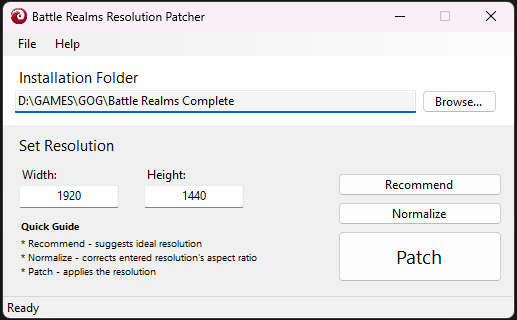

# Battle Realms Resolution Patcher

*Download:* https://github.com/AtsusaKai/Battle-Realms-Resolution-Patcher/releases/tag/v1.0.0.0

Battle Realms is a real-time strategy video game published and released by Crave Entertainment and Ubi Soft in November 2001.

Battle Realms uses 4:3 aspect ratio with very low resolutions. This patcher allows for custom resolutions with (GOG) Battle Realms + Winter of the Wolf, including widescreen resolutions.

## Support
This patcher currently supports GOG.com version of Battle Realms only. It doesn't work with Steam's Battle Realms: Zen Edition at the moment.

## How to Use
1. Install "Battle Realms + Winter of the Wolf" - https://www.gog.com/en/game/battle_realms_winter_of_the_wolf.
2. Download and run BRResPatcher.exe (requires .NET 6.0 or higher), then locate Battle Realms' installation directory. 
3. Enter your resolution, OR press the "Recommend" button to automatically get one based on your current display. 
4. Click "Patch" to apply the new resolution.
5. Run the game. If an error occured, such as, Rasterizer API error, repeat from step 3 as the set resolution might be too big or too out of proportion.

* The "Normalize" button can be used to calculate the width based from an entered resolution height.

## Remarks
I made this program for fun, a GUI inspired by Felix Krull's resolution patcher written in Python. If you found any bugs, you can email me at kai.atsusa@gmail.com.
